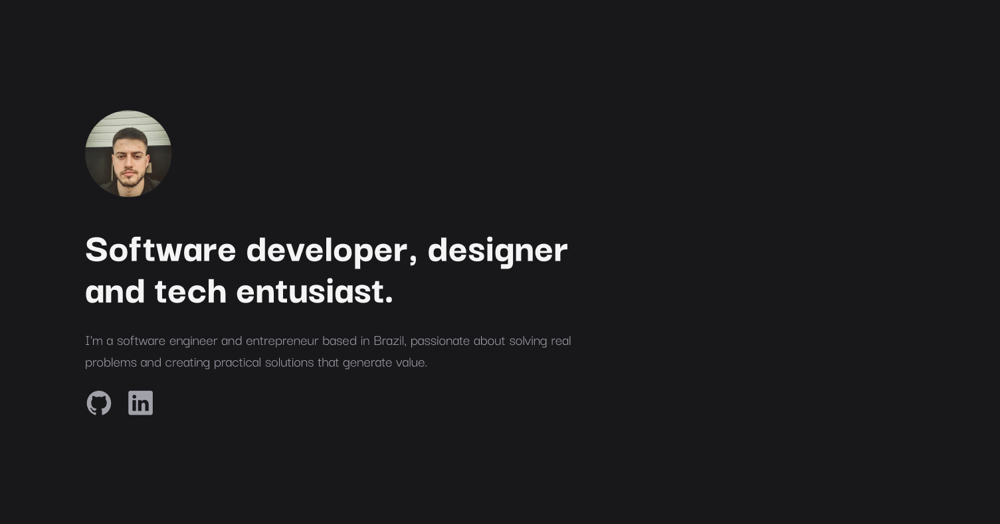
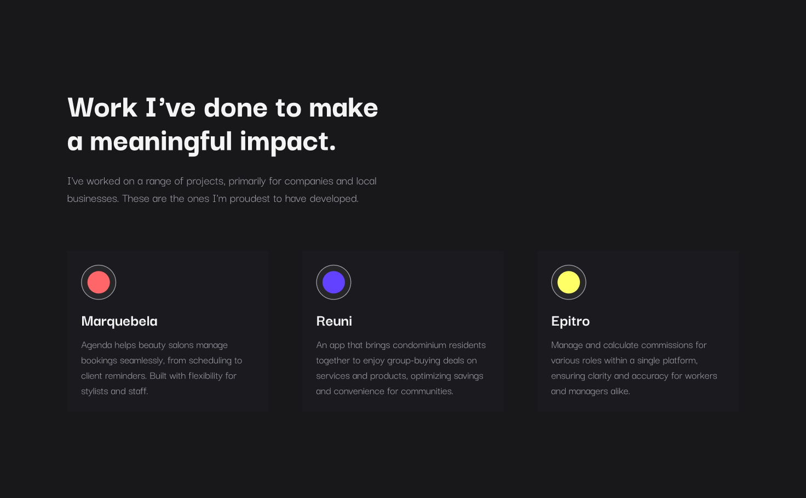

<h1 align="center" style="font-weight: bold;">Portfolio 💻</h1>

 <a href="#tech">Technologies</a>

    <b>Personal portfolio showcasing my skills, previous projects, and technologies I specialize in. It highlights the work I've done and the solutions I've built, demonstrating my expertise as a software developer.</b>

     <a href="https://brunocardozo.com.br">📱 Visit this Project</a>

<h2 id="layout">🎨 Layout</h2>

    
    

<h2 id="technologies">💻 Technologies</h2>

- HTML
- CSS
- Javascript